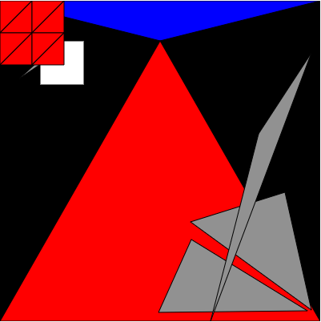

# generative-art-group-collaboration
This is a generative art group collaborative work

## Students have to change the code

The order is

- Dan
- Khang
- William
- Dongjae

## Starting code

``` js
function setup() {
  createCanvas(400, 400);
  background(220, 0, 0);
  // Draw a circle at location (30, 30) with a diameter of 20.
  circle(30, 30, 20);
  // Change by Dan
  
  // Change by Khang
  
  // Change by William
  
  // Change by Dongjae
  
}

function draw() {
  //background(220);
}
```

## Final "Masterpiece" after 20 minutes



``` js

function setup() {
  createCanvas(400, 400);
  background(0, 0, 0);
  // Draw a circle at location (30, 30) with a diameter of 20.
  circle(30, 30, 20);

  // Change by Dan
  rect(50, 50, 55, 55);

  // Change by Khang
  let c1 = color(0,0,255)
  fill(c1)
  triangle(0, 0, 200, 50, 400, 0);
  let c2 = color(255,0,0)
  fill(c2)
  triangle(400, 400, 200, 50, 0, 400);

  // Change by William
  let ran = random(0,255)
  let rancolor = color(ran,ran,ran)
  fill(rancolor)
  triangle(50,25,78,32,65,12);
  triangle(356,239,389,386,238,276);
  triangle(23,98,45,78,67,68);
  triangle(239,298,384,387,198,389);
  triangle(389,65,263,400,323,166);
  
  // Change by Dongjae
  for(var i = 0; i < 2; i++){
    for(var j = 0; j < 2; j++){
      fill(255, 0, 0)
      TRIANGLE_HEIGHT = 40
      let point1X = i*TRIANGLE_HEIGHT
      let point1Y = j*TRIANGLE_HEIGHT
      let point2X = (i+1)*TRIANGLE_HEIGHT
      let point2Y = j*TRIANGLE_HEIGHT
      let point3X = i*TRIANGLE_HEIGHT
      let point3Y = (j+1)*TRIANGLE_HEIGHT
      let point4X = (i+1)*TRIANGLE_HEIGHT
      let point4Y = (j+1)*TRIANGLE_HEIGHT
      triangle(point1X, point1Y, point2X, point2Y, point3X, point3Y)
      triangle(point2X, point2Y, point3X, point3Y, point4X, point4Y)
    }
  }  
}

function draw() {
  //background(220);
}
```
